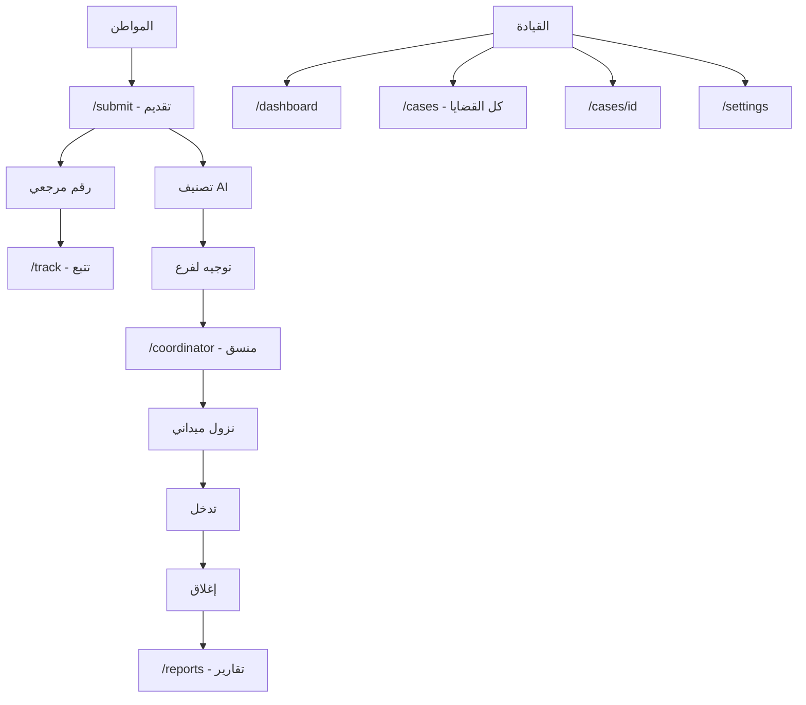

## نظرة عامة على المشروع

منصة Frontend-only كاملة الميزات بصرياً تحاكي منتج Civic-Tech حقيقي. كل تفاعل يعمل بصرياً (Modals, Toasts, Mock state updates) بدون أي Backend.

---

## 1. الهوية البصرية المُستخرجة من اللوغو

**الألوان (Design Tokens):**

- **Primary (الأخضر الزمردي):** `#047857` (الأساسي), `#065f46` (داكن), `#064e3b` (أعمق)
- **Accent (الذهبي):** `#c9a227` (الأساسي), `#e8c547` (فاتح), `#fef3c7` (خلفية)
- **Neutrals:** `#fafaf9` (off-white), `#f5f5f4`, `#e7e5e4`, `#78716c`, `#1c1917`
- **Semantic:** أخضر للنجاح، أحمر `#dc2626` للحرج، عنبري `#d97706` للتحذير، أزرق `#2563eb` للمعلومات

**الخطوط:**
- **عناوين:** `Noto Kufi Arabic` (وزن 700-800) — رسمي ومهيب
- **نصوص:** `Cairo` (وزن 400-600) — مريح للقراءة الطويلة
- **أرقام:** `JetBrains Mono` للمراجع `REF-2026-XXXXX`

**نمط بصري:**
- خلفيات شبكية ناعمة `repeating-linear-gradient` بزاوية 60°
- Cards بـ `rounded-2xl` + ظلال ناعمة (`shadow-sm` افتراضي، `shadow-lg` على hover)
- خط ذهبي فاصل (Gold Line) تحت الـ Header
- تدرجات ناعمة من `#064e3b` إلى `#047857` للـ Hero
- زخرفة دوائر شفافة في زوايا الأقسام البطولية

---

## 2. هيكل المشروع

```
/app
  layout.tsx              ← Root layout + RTL + Fonts + Toaster
  page.tsx                ← Landing
  /submit/page.tsx
  /track/page.tsx
  /dashboard/page.tsx
  /coordinator/page.tsx
  /cases/page.tsx
  /cases/[id]/page.tsx
  /reports/page.tsx
  /settings/page.tsx
  globals.css             ← Tailwind + custom tokens

/components
  /landing                ← Hero, Stats, Timeline, AIDemo, Heatmap, ...
  /dashboard              ← KPICards, BranchChart, CaseTable, ...
  /cases                  ← CaseHeader, AIClassification, TimelineFull, ...
  /shared                 ← Navbar, Footer, Logo, StatusBadge, PriorityBadge
  /ui                     ← shadcn components

/data
  cases.ts                ← 20 قضية واقعية
  branches.ts             ← 8 فروع
  coordinators.ts         ← 6 منسقين
  committees.ts           ← 5 لجان
  citizens.ts
  charts.ts               ← بيانات Recharts
  timeline.ts

/types
  index.ts                ← كل الـ TypeScript types

/lib
  utils.ts                ← cn, formatDate (ar), formatRef
  constants.ts            ← الحالات، الأولويات، SLA
```

---

## 3. الـ TypeScript Types

ملف موحد `[types/index.ts](types/index.ts)` يحتوي:

```typescript
export type CaseStatus = "new" | "classifying" | "assigned" | "in_progress" | "field_visit" | "intervention" | "resolved" | "closed" | "escalated";
export type Priority = "critical" | "high" | "medium" | "low";
export type SLAStatus = "on_track" | "at_risk" | "breached";
export type CaseType = "service" | "legal" | "political" | "suggestion";

export interface Case { id, ref, title, description, status, priority, type, branchId, coordinatorId?, citizenId, createdAt, updatedAt, slaStatus, aiClassification, timeline, attachments, isDuplicate?, duplicateOf? }
export interface Citizen { id, name?, phone?, isAnonymous, governorate, district }
export interface Branch { id, name, governorate, casesCount, performance, coordinatorIds }
export interface Coordinator { id, name, branchId, activeCases, completedCases, avatar, phone }
export interface Committee { id, name, casesAssigned, members }
export interface TimelineEvent { id, type, title, description, actor, timestamp, status }
export interface AIClassification { suggestedType, suggestedBranch, priority, confidence, duplicateRisk }
export interface ReportMetric { label, value, change, trend }
```

---

## 4. الصفحات بالتفصيل

### `/` — Landing Page (الصفحة الأكثر أهمية)

ترتيب الأقسام:
1. **Navbar** sticky + Gold Line
2. **Hero**: خلفية أخضر داكن + شبكة هندسية + دوائر زخرفية + Badge متحرك (43 فرع نشط) + عنوان كبير "صوتك يصل — شكواك تُحلّ" + كروت عائمة 5 حالات (جديد، قيد التصنيف، قيد المتابعة، نزول، مكتمل) + زرين CTA
3. **شريط الثقة (Stats Bar)**: 43 فرع + SLA للاستجابة + لوحة قيادة + رقم مرجعي فوري — مع counters متحركة
4. **"ما هي المنصة؟"**: 3 كروت (استقبال ذكي، توجيه آلي، تدخل ميداني)
5. **رحلة الشكوى (Timeline)**: 7 خطوات عمودية على الموبايل، أفقية على Desktop، مع SVG path متحرك
6. **محاكاة التصنيف الذكي (AI Demo)**: نص شكوى وهمي + 5 حقول نتائج (التصنيف، الأولوية، الفرع، الثقة 94%, تكرار محتمل) — مع typing animation
7. **إحصائيات عامة**: 5 counters (1247 قضية، 89% إغلاق، 312 نزول، 2.3 يوم متوسط، 47 مكررة)
8. **خريطة حرارية رمزية**: شبكة 8x8 خلايا بألوان متدرجة حسب كثافة القضايا في كل منطقة
9. **أنواع القضايا**: 4 كروت (خدمية، قانونية، سياسية، مقترحات) بأيقونات مميزة
10. **الخصوصية والشفافية**: قسم بكروت أمان (تقديم مجهول، تشفير، حذف عند الإغلاق)
11. **SLA والتصعيد**: جدول وقتي تصاعدي
12. **CTA نهائي** + **Footer**

### `/submit` — Stepper متعدد الخطوات
5 خطوات مع Progress Bar علوي:
- بيانات الطلب (النوع، العنوان، الوصف)
- الموقع (الفرع، المحافظة، المنطقة، خريطة رمزية)
- بيانات المواطن (مع toggle "تقديم مجهول")
- المرفقات (Drag & Drop Mock)
- مراجعة وإرسال

عند الإرسال → Modal نجاح بأنيميشن + رقم مرجعي `REF-2026-00482` + زر "تتبع الطلب" / "نسخ الرقم" + Toast.

### `/track` — تتبع
حقل إدخال كبير في المنتصف. عند البحث:
- إذا الرقم موجود في Mock → بطاقة قضية + Timeline مختصر + حالة
- إذا غير موجود → رسالة لطيفة "لم نجد قضية بهذا الرقم"

أرقام تجريبية معروضة كـ chips للتجربة السريعة.

### `/dashboard` — لوحة القيادة
- 4 KPI Cards علوية (إجمالي، مفتوحة، متأخرة SLA، مغلقة هذا الشهر)
- Recharts: PieChart للأنواع + BarChart لأداء الفروع + AreaChart للاتجاه الأسبوعي
- جدول آخر 10 قضايا
- قسم "متأخرة عن SLA" بـ Badge أحمر
- قسم "قضايا مكررة محتملة" مع نسبة التشابه
- خريطة حرارية صغيرة
- شريط فلاتر علوي (الفرع، التاريخ، النوع، الحالة)

### `/coordinator` — لوحة المنسق الميداني
- Header ببيانات المنسق + إحصائياته اليوم
- "مهامي اليوم" — قائمة Cards
- "قضايا قيد المتابعة" — Cards مع quick actions
- "زيارات ميدانية مجدولة" — Timeline زمني
- "القضية التالية" — Card كبيرة بارزة
- 4 أزرار سريعة (اتصال، جدولة زيارة، رفع ملاحظة، تغيير حالة) كلها تفتح Modals وهمية + Toasts

### `/cases` — قائمة القضايا
- شريط فلاتر متقدم + بحث
- Table responsive (يتحول إلى Cards على الموبايل)
- أعمدة: الرقم، العنوان، الحالة (Badge)، الأولوية (Badge)، الفرع، المنسق، SLA، آخر تحديث، إجراءات
- Pagination + Page Size

### `/cases/[id]` — تفاصيل القضية
تصميم بـ 2 columns على Desktop / Stack على Mobile:

**العمود الرئيسي:**
- Header: رقم + العنوان + Status + Priority + SLA Badge
- بيانات المواطن
- وصف المشكلة
- AI Classification Card (Confidence Score + Bar)
- Duplicate Detection Card (إذا فيه تكرار)
- Timeline كامل (7-12 حدث)
- مرفقات وهمية (صور placeholder + PDF)

**العمود الجانبي (Actions):**
- 6 أزرار (تحديث الحالة، تحويل للجنة، تصعيد، دمج، إغلاق، إضافة ملاحظة) كلها Modals
- معلومات الفرع والمنسق المسؤول
- جدول التواريخ (إنشاء، آخر تحديث، استحقاق SLA)

### `/reports` — التقارير
- Tabs (أسبوعي / شهري / ربع سنوي)
- 6 KPI Cards
- BarChart أداء الفروع
- BarChart أداء المنسقين
- PieChart أكثر أنواع القضايا
- جدول التوصيات التشغيلية
- زر "تصدير PDF" (Mock — يفتح Toast)

### `/settings` — إعدادات
6 Tabs:
- الفروع (جدول 8 فروع + زر "إضافة فرع" Modal)
- اللجان (جدول 5 لجان)
- SLA (شريط حدودي لكل أولوية)
- الصلاحيات RBAC (مصفوفة Roles × Permissions)
- Audit Log (جدول آخر 20 إجراء)
- المظهر (تبديل Light/Dark — مزخرف)

---

## 5. المكونات المشتركة الأساسية

- **`Logo.tsx`** — مكون يستخدم اللوغو المرفق (PNG) + اسم المنصة بجانبه
- **`Navbar.tsx`** — Sticky + Mobile Drawer + Active Link Highlighting
- **`Footer.tsx`** — مع Gold Line علوي
- **`StatusBadge.tsx`** + **`PriorityBadge.tsx`** + **`SLABadge.tsx`** — variants حسب القيمة
- **`StatCard.tsx`** — مع counter متحرك (Framer Motion)
- **`Heatmap.tsx`** — شبكة خلايا ملونة تفاعلية
- **`Timeline.tsx`** — عمودي/أفقي حسب الـ prop
- **`PageHeader.tsx`** — موحّد لكل الصفحات الداخلية

---

## 6. Mock Data واقعية (محتوى أردني/عربي)

- **8 فروع:** عمان الأول، عمان الثاني، الزرقاء، إربد، الكرك، السلط، المفرق، العقبة
- **6 منسقين:** أسماء عربية واقعية + أرقام هواتف وهمية + إحصائيات
- **5 لجان:** الخدمات، القانونية، الشؤون السياسية، النساء والأسرة، التواصل المجتمعي
- **20 قضية** متنوعة (تسرب مياه، انقطاع كهرباء، نزاع إيجار، اقتراح تعبيد، حفرة طريق، إنارة، ...) بحالات وأولويات وتواريخ مختلفة
- **بيانات Charts** — 7 أيام، 12 شهر، 8 فروع

---

## 7. Animations & Interactions

- **Framer Motion** على: Hero entrance, scroll reveals (مع `useInView`), counter animations, modal transitions, stagger للقوائم
- **Toasts** بـ `sonner` (مدمجة في shadcn) — لكل إجراء وهمي رسالة لطيفة
- **Modals** — كل زر إجراء له Modal يحاكي العملية + يعرض Toast نجاح
- **Skeleton loaders** على جداول الـ Dashboard

---

## 8. Mobile-First Strategy (أهم نقطة)

- Breakpoints: `sm:640px`, `md:768px`, `lg:1024px`, `xl:1280px`
- Navbar → Hamburger Drawer من اليمين (RTL)
- Tables → تتحول لـ Cards عمودية تحت `md`
- Stepper → Vertical على الموبايل
- Hero → نص أصغر + أزرار full-width
- Timeline → عمودي افتراضياً
- Heatmap → 4 أعمدة على الموبايل بدل 8
- Touch-friendly targets (44px minimum)

---

## 9. مخطط التدفق (Mermaid)



---

## 10. خطوات التنفيذ المتسلسلة

سأنفذ على 9 مراحل قابلة للقياس، كل مرحلة منفصلة في الـ Todos أدناه.

---

## 11. تأكيدات نهائية

- لا `any` في TypeScript — كل شيء typed بدقة
- لا inline styles — كل التنسيق Tailwind classes
- لا lorem ipsum — كل النصوص عربية واقعية
- كل زر له action (Modal/Toast/Navigation/State change)
- `npm run build` + `tsc --noEmit` يمران بنجاح في النهاية