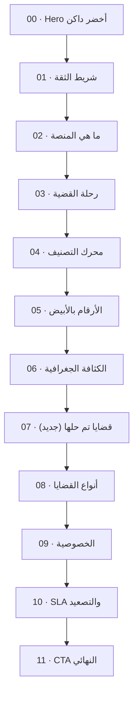

# إعادة تصميم الصفحة الرئيسية للزوار

## 1. التشخيص الحالي

ملف الصفحة [`app/page.tsx`](app/page.tsx) فيه 11 قسم. المشكلات:

- **3 مناطق داكنة منفصلة** ([Hero](components/landing/hero.tsx) + [StatsCounters](components/landing/stats-counters.tsx) + [FinalCTA](components/landing/final-cta.tsx)) تشتّت العين
- **تتابع خلفيات عشوائي**: داكن - أبيض - ستون - أبيض - داكن - ستون - أبيض - ستون - أبيض - ستون
- **Grid patterns بكثافة مرتفعة** (`opacity-40` و `opacity-50`) في Journey و Privacy تتعب القراءة
- **3 مناطق ستون** بدون هدف بصري واضح
- **مسافات Section غير موحّدة** (`py-20` تارة و `py-24` تارة)

## 2. الفلسفة البصرية الجديدة - البياض الذكي

> الصفحة كلها بيضاء نقية، الهوية تظهر عبر التفاصيل (لمسات ذهبية وزمردية، Aurora شفافة جداً)، والاستثناء الوحيد هو Hero كبطاقة هوية بصرية في الأعلى.

**المبادئ الخمسة:**

1. **One Dark Moment** - الأخضر الداكن مرة واحدة فقط (Hero)
2. **Whisper Textures** - الـ Aurora والشبكات تنخفض إلى 4-8% opacity
3. **Gold as a Thread** - خط ذهبي رفيع 1px يربط الأقسام بدل تغيير الخلفيات
4. **Glass Cards** - كل الكروت موحّدة بـ `backdrop-blur-sm` + `border-stone-100/80` + `shadow-soft-md`
5. **Section Numbering** - رقم سيريالي خفيف (`01 - 02 - 03`) فوق كل قسم

## 3. الترتيب الجديد للأقسام (12 قسم)



**التعديلات على الترتيب:**
- Stats انتقلت بعد AIDemo (إيقاع: شرح - دليل تقني - دليل رقمي - دليل جغرافي - دليل اجتماعي)
- Hall of Resolved Cases (قسم جديد) بين Heatmap و Categories - ينقل من الإحصائيات الباردة إلى القصص الإنسانية

## 4. التغييرات التفصيلية لكل قسم

### Section 0 - Hero (يبقى داكن لكن مُعاد ضبطه)

ملف [`components/landing/hero.tsx`](components/landing/hero.tsx):

- إبقاء `hero-gradient` لكن **تخفيف الشبكة** من `opacity-100` إلى `opacity-30`
- استبدال الدوائر المتمركزة بـ Aurora blob ذهبية واحدة كبيرة في الزاوية اليسرى
- إعادة ترتيب الكروت العائمة الـ 5 في **قوس** نصف دائري حول العنوان
- إضافة **سهم أخضر-ذهبي متحرك للأسفل** كـ scroll cue
- تقليل padding من `pb-32` إلى `pb-24`

### Section 1 - TrustBar

ملف [`components/landing/trust-bar.tsx`](components/landing/trust-bar.tsx):

- استبدال `bg-stone-200` بين الكروت بخط ذهبي رفيع `bg-gold-200/40`
- إضافة علامة `+` ذهبية صغيرة بين كل كرتين

### Section 2 - WhatIs (Bento)

ملف [`components/landing/what-is.tsx`](components/landing/what-is.tsx):

- Bento layout: الكرت الأوسط (تصنيف وتوجيه آلي) **2x أعرض** على Desktop
- إضافة رقم خفيف `01`، `02`، `03` أعلى يمين كل كرت بخط Display ذهبي شفاف

### Section 3 - JourneyTimeline (Curved Path)

ملف [`components/landing/journey-timeline.tsx`](components/landing/journey-timeline.tsx):

- إزالة `bg-stone-50` و `grid-pattern-light` بالكامل ← `bg-white`
- استبدال الـ SVG line المستقيم بمنحنى Bezier ذهبي organic
- تكبير الدوائر من `w-20 h-20` إلى `w-24 h-24` مع `glow-emerald` على hover

### Section 4 - AIDemo (Glass)

ملف [`components/landing/ai-demo.tsx`](components/landing/ai-demo.tsx):

- استبدال `bg-stone-50` للكرت الأيسر بـ Glass card: `bg-white/80 backdrop-blur border border-emerald-100`
- إضافة شريط ثقة متحرك من emerald إلى gold يصل لـ 94%
- بطاقة "نتيجة التحليل" تنبثق فوق الكرت بـ checkmark أخضر بعد التحليل

### Section 5 - StatsCounters (تحوّل جذري إلى أبيض)

ملف [`components/landing/stats-counters.tsx`](components/landing/stats-counters.tsx):

> **هذا أكبر تغيير**. القسم كان أخضر داكن - يصبح أبيض بالكامل:

- خلفية `bg-white` + Aurora blob ذهبية شفافة 8% خلف الأرقام
- 5 كروت زجاجية: `bg-white border-2 border-emerald-100/60 shadow-soft-md`
- الأرقام بحجم ضخم (`text-5xl lg:text-6xl`) باللون `text-emerald-700`
- خط ذهبي رفيع تحت كل رقم
- الأيقونة بـ rounded badge `bg-gold-50 text-gold-700`

### Section 6 - HeatmapSection (استراحة بصرية)

ملف [`components/landing/heatmap-section.tsx`](components/landing/heatmap-section.tsx):

- القسم الوحيد الذي يحصل على `bg-stone-50/50` خفيف جداً كنَفَس بصري
- إطار ذهبي رفيع للـ Heatmap + legend جديد بألوان emerald
- البطاقات الجانبية الثلاث تتحول إلى Glass cards
- mini-tooltip عند hover على كل خلية

### Section 7 - Hall of Resolved Cases (قسم جديد بالكامل)

ملف جديد `components/landing/resolved-marquee.tsx`:

> القسم الإنساني الذي تفتقده الصفحة حالياً.

- خلفية `bg-white` + Aurora شفافة خضراء 6%
- شريط Marquee أفقي يستفيد من `marquee-curve` keyframe الموجود فيه 8 بطاقات قضايا تم حلها:
  - رقم مرجعي `REF-2025-XXXXX`
  - عنوان مختصر (تسرّب مياه - حي النزهة)
  - منطقة + تاريخ الإغلاق
  - مدة الحل (حُلّت في 2.1 يوم)
  - شارة CheckCircle2 خضراء
- البطاقات تتوقف عند hover
- تكرار: نسختان من المصفوفة جنباً إلى جنب لـ infinite scroll
- عنوان القسم: صوت وصل، شكوى حُلّت

### Section 8 - Categories (Bento Grid)

ملف [`components/landing/categories.tsx`](components/landing/categories.tsx):

- Bento layout غير متناظر: الكرت الأول خدمية يأخذ **2x2** ضمن grid 4-col
- على الكرت الكبير: رسم scribble أخضر شفاف لخريطة بسيطة
- chip متحرك "الأكثر تقديماً" بلون gold على الكرت الكبير
- على Mobile: يعود grid 2x2 عادي

### Section 9 - Privacy

ملف [`components/landing/privacy.tsx`](components/landing/privacy.tsx):

- إزالة `bg-emerald-50/30` و `grid-pattern-light` ← `bg-white`
- Aurora blob خضراء شفافة 8% في الزاوية اليمنى العلوية
- الكروت الأربعة Glass cards مع أيقونة قفل ذهبية صغيرة
- شريط معلومات سفلي "متوافق مع معايير ISO 27001" + شعارات وهمية

### Section 10 - SLASection

ملف [`components/landing/sla-section.tsx`](components/landing/sla-section.tsx):

- استبدال الكروت الأربعة بـ **timeline أفقي زمني**:
  - شريط أفقي طويل بطول الـ container
  - 4 نقاط دائرية ملونة (أحمر - برتقالي - عنبري - رمادي)
  - تحت كل نقطة بطاقة صغيرة بالأولوية والوقت
- بطاقة "آلية تصعيد آلية" تكبر وتصبح dashboard mock بسيطة تظهر تصعيد قضية وهمية live

### Section 11 - FinalCTA (تحوّل لأبيض)

ملف [`components/landing/final-cta.tsx`](components/landing/final-cta.tsx):

- خلفية الـ section: `bg-white` + Aurora ذهبية + خضراء شفافتين
- بطاقة CTA: `bg-white border-2 border-emerald-200` مع شعار المنصة كـ watermark خفيف
- العنوان بـ emerald-900 + النص بـ stone-600
- زرّان: gold (Primary) + emerald-outline (Secondary)
- 3 شارات صغيرة فوق الـ CTA: دقيقتان / مجهول / بدون تسجيل

## 5. البنية التقنية الجديدة

### مكون موحّد جديد `components/landing/section-shell.tsx`

```typescript
interface SectionShellProps {
  number: string;
  tone?: "white" | "off-white";
  aurora?: "emerald" | "gold" | "both" | "none";
  spacing?: "regular" | "tight";
  children: React.ReactNode;
}
```

يدير: المسافة العمودية، رقم القسم العلوي، Aurora blobs الشفافة، الفصل الذهبي السفلي.

### تحديث [`app/globals.css`](app/globals.css)

- تخفيف `grid-pattern-light` من 4% إلى **2%** opacity
- إضافة `aurora-soft-emerald` و `aurora-soft-gold` كطبقات خفيفة جداً (8-12%)
- إضافة `gold-divider` كخط فاصل أفقي بين الأقسام
- تحديث `--background` إلى `0 0% 100%` (أبيض نقي) بدل `60 9% 98%`

### تحديث [`app/page.tsx`](app/page.tsx)

استيراد `ResolvedMarquee` من `@/components/landing/resolved-marquee` ووضعه بين `HeatmapSection` و `Categories`.

## 6. لمسات مايكرو-تفاعلية

- Scroll progress bar ذهبي (1px) أعلى الصفحة
- Section anchor pills في الجانب الأيمن للتنقل بين الـ 12 قسم
- Cursor glow على Hero فقط - هالة خضراء شفافة تتبع المؤشر
- Card lift على كل الكروت: `hover:-translate-y-0.5` + shadow grows
- Number count-up محسّن بـ tabular-nums + ease-out cubic
- Marquee pause على hover

## 7. ملف بيانات جديد

`data/resolved-cases.ts` - 8 قضايا مغلقة أردنية واقعية:
- ref, title, district, closedAt, durationDays
- محتوى متنوع (تسرب مياه، إنارة شارع، حفرة طريق)

## 8. الملفات المتأثرة

**سيتم تعديلها (13 ملف):**
- [`app/page.tsx`](app/page.tsx)
- [`app/globals.css`](app/globals.css)
- [`components/landing/hero.tsx`](components/landing/hero.tsx)
- [`components/landing/trust-bar.tsx`](components/landing/trust-bar.tsx)
- [`components/landing/what-is.tsx`](components/landing/what-is.tsx)
- [`components/landing/journey-timeline.tsx`](components/landing/journey-timeline.tsx)
- [`components/landing/ai-demo.tsx`](components/landing/ai-demo.tsx)
- [`components/landing/stats-counters.tsx`](components/landing/stats-counters.tsx) - تحوّل جذري
- [`components/landing/heatmap-section.tsx`](components/landing/heatmap-section.tsx)
- [`components/landing/categories.tsx`](components/landing/categories.tsx)
- [`components/landing/privacy.tsx`](components/landing/privacy.tsx)
- [`components/landing/sla-section.tsx`](components/landing/sla-section.tsx)
- [`components/landing/final-cta.tsx`](components/landing/final-cta.tsx) - تحوّل جذري

**سيتم إنشاؤها (3 ملفات):**
- `components/landing/section-shell.tsx` - Wrapper موحّد
- `components/landing/resolved-marquee.tsx` - قسم جديد
- `data/resolved-cases.ts` - بيانات الـ 8 قضايا المغلقة

## 9. ضمانات الجودة

- `npx tsc --noEmit` يجب أن يمر
- `npm run build` يجب أن يمر
- Responsive: 360px / 768px / 1280px
- Reduced motion: كل الأنيميشنات تحترم `prefers-reduced-motion`
- A11y: focus rings emerald واضحة على كل عنصر تفاعلي